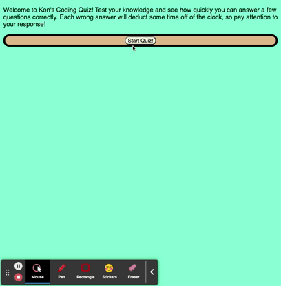

# Code Quiz
  
  
  ## Description
  In this project, I use JavaScript to create a coding quiz. The application has a start button that initiates the quiz. A time starts counting down. If you get a question wrong, you loose 10 seconds from your countdown. If you get the answer right, you gain a point. At the end of the quiz you are presented with a text box to input your initals, which will be saved to localstorage, allowing multiple players to input their initials. 
  
  ## Table of Contents
  - [Description](#)
  - [Screencapture](#screencapture)
  - [Installation](#installation)
  - [Usage](#usage)
  - [License](#license)
  - [Credits](#credits)
  - [Links](#links)
  - [Tests](#tests)
  - [Questions](#questions)
  
  ## Screencapture
  

  ## Installation
  There is no installation process.
  
  ## Usage
  This is a website that offers a quiz that will test your coding knowledge!  

  ## License
  MIT
  
  ## Credits
  Konner Hartman (myself)

  ## Links
  Deployed page: 
   
  https://konnerhartman.github.io/Code-Quiz/
   
   
  GitHub Repository:
   
  https://github.com/konnerhartman/Code-Quiz/
  
  ## Tests
  There are no tests for this project.
  
  ## Questions
  Any questions can be directed to:
   
  Github: [konnerhartman](https://github.com/konnerhartman)
   
  Email: konner.hartman@yahoo.com
